# 🛡️ Linux Bash Data Backups Automation in Linux VirtualBox VM

This project demonstrates how to automate daily backups of Linux user data and system configuration using Bash scripts on an Ubuntu virtual machine. It's designed for IT Support professionals to practice scripting and data protection fundamentals in a lab environment.

---

## 🧰 Prerequisites

- [Oracle VirtualBox](https://www.virtualbox.org/wiki/Downloads) (Download Platform Package and Extension Pack)
- Ubuntu ISO file: [Ubuntu Desktop 24.04.2 LTS](https://ubuntu.com/download/desktop)
- A Windows or macOS host system
- [Bash Backup Script] & [Test Bash Backup Script]

---

## 💻 1. Setup Oracle VirtualBox + Ubuntu VM

Download and install Oracle VirtualBox on your host system.

Open VirtualBox → Click New

  - Name: LinuxVM

  - Type: Linux
  
  - Subtype: Ubuntu 

  - Version: Ubuntu (64-bit)

  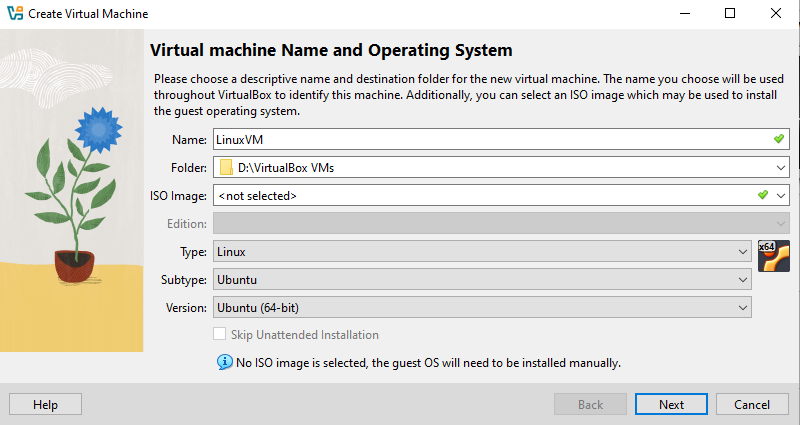

Allocate resources:

  - RAM: At least 2048 MB

  - CPU: 2 cores

  - Disk: 25 GB (dynamically allocated)

  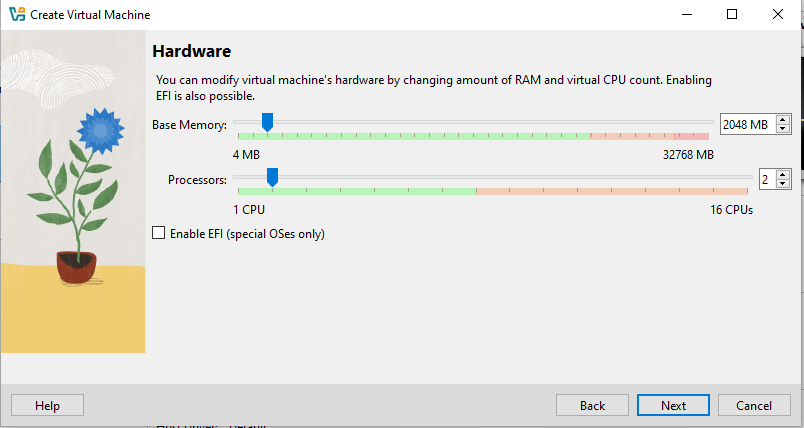

  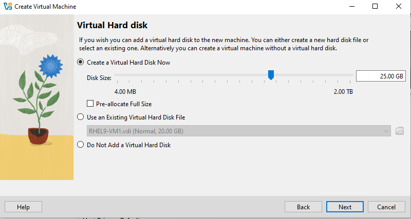

Mount the Ubuntu 24.04.2 ISO and start the VM

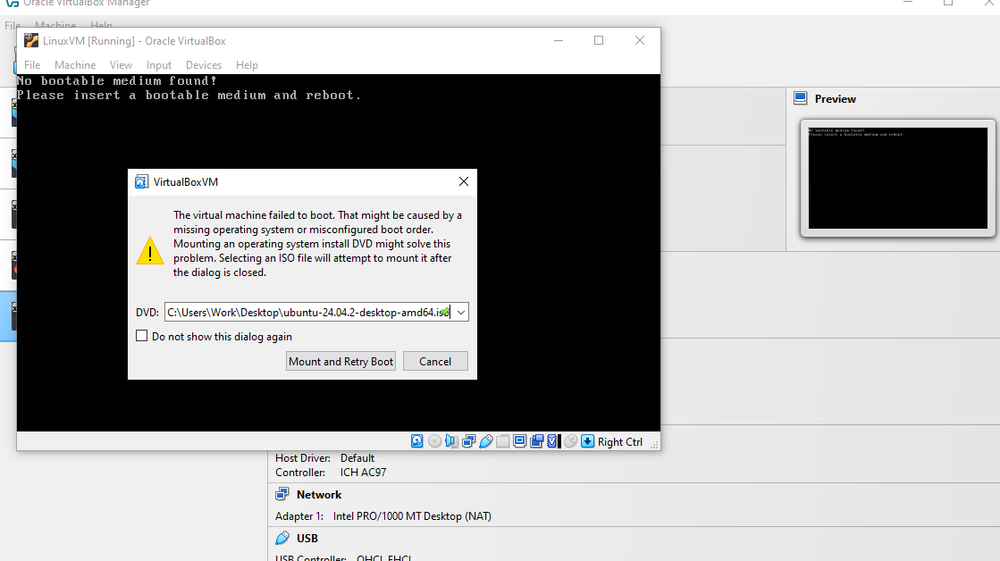

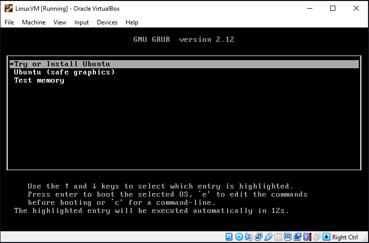

Complete the Ubuntu installation, set machine name to LinuxVM, and create username and password

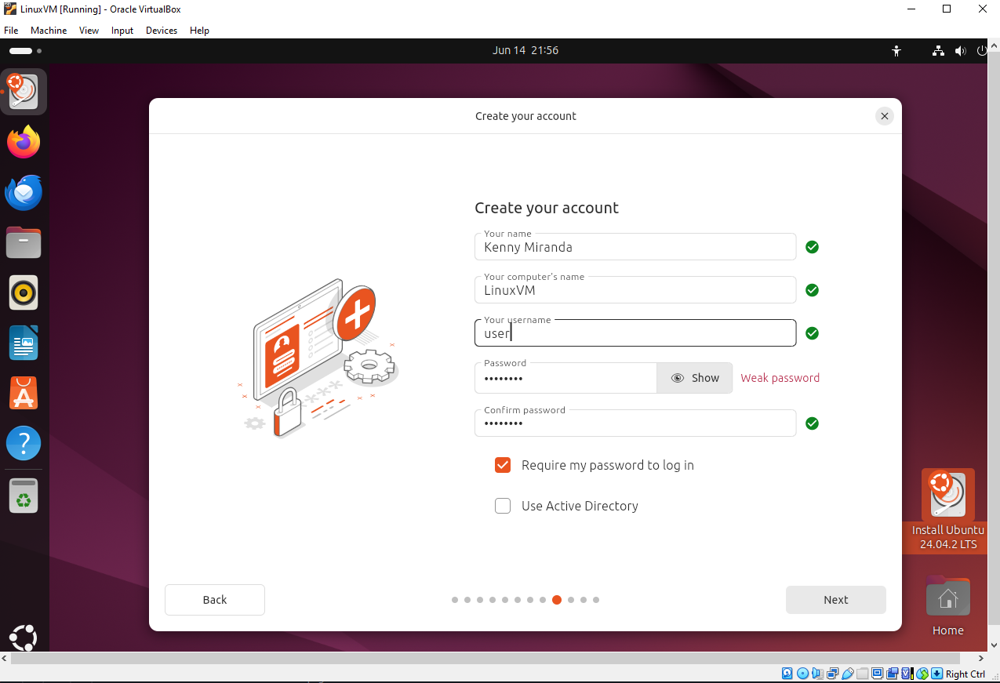

---

## 🛠️ 2. Initial Ubuntu Setup
Log into your Ubuntu VM

Open Terminal and update the system:

```
sudo apt update && sudo apt upgrade -y
```

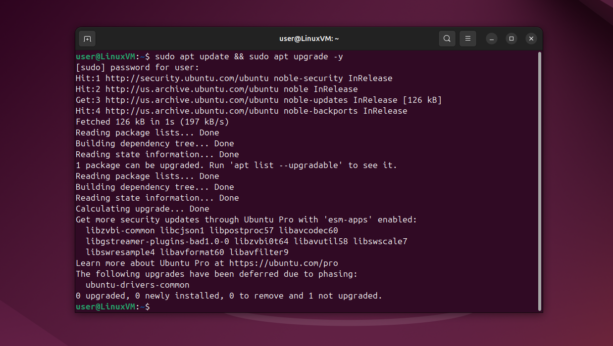

(Optional) Install essential tools:

```
sudo apt install git curl wget net-tools tree -y
```

Enable Shared Clipboard & Drag-and-Drop by Installing Guest Additions:

- From VirtualBox menu bar: Devices > Insert Guest Additions CD image…

- Run autorun.sh and install anything missing

  ```
  sudo apt install build-essential dkms linux-headers-$(uname -r)
  ```

- Reboot the VM.

- Enable clipboard & drag-and-drop in VM Settings → General > Advanced:

    - Shared Clipboard: Bidirectional

    - Drag and Drop: Bidirectional
 
    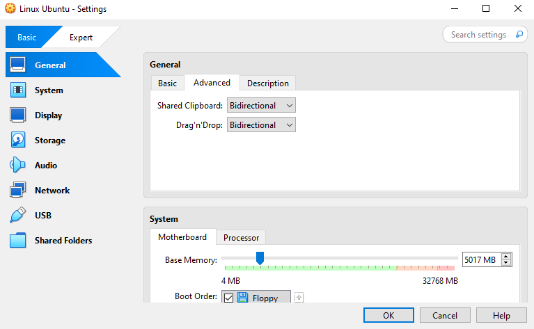

---

## 📝 3. Write the Backup Script

Create and open the script file:

```
nano ~/backup.sh
```

Paste the following:

```
#!/bin/bash

DATE=$(date +"%Y-%m-%d_%H-%M-%S")
HOSTNAME=$(hostname)
FILENAME="backup_${HOSTNAME}_${DATE}.tar.gz"
BACKUP_DIR="$HOME/backups"
RETENTION_DAYS=7
LOG_TAG="vm-backup"

# Specific files/folders you want to back up
SPECIFIC_DIRS=(
  "$HOME/Documents"
  "$HOME/Desktop"
  "$HOME/.config"
  "$HOME/projects"
  "/etc"
)

# Dynamically include all real user home directories
USER_HOMES=($(awk -F: '$3 >= 1000 && $7 ~ /bash|sh/ { print $6 }' /etc/passwd))

# Combine both
SOURCE_DIRS=("${SPECIFIC_DIRS[@]}" "${USER_HOMES[@]}")

# Create backup directory if it doesn’t exist
mkdir -p "$BACKUP_DIR"

# Create the archive
tar -czf "$BACKUP_DIR/$FILENAME" "${SOURCE_DIRS[@]}"

# Log result
logger -t "$LOG_TAG" "Backup created: $BACKUP_DIR/$FILENAME"

# Delete old backups
find "$BACKUP_DIR" -name "*.tar.gz" -type f -mtime +$RETENTION_DAYS -exec rm {} \;
logger -t "$LOG_TAG" "Old backups older than $RETENTION_DAYS days deleted"

echo "Backup complete: $FILENAME"
```

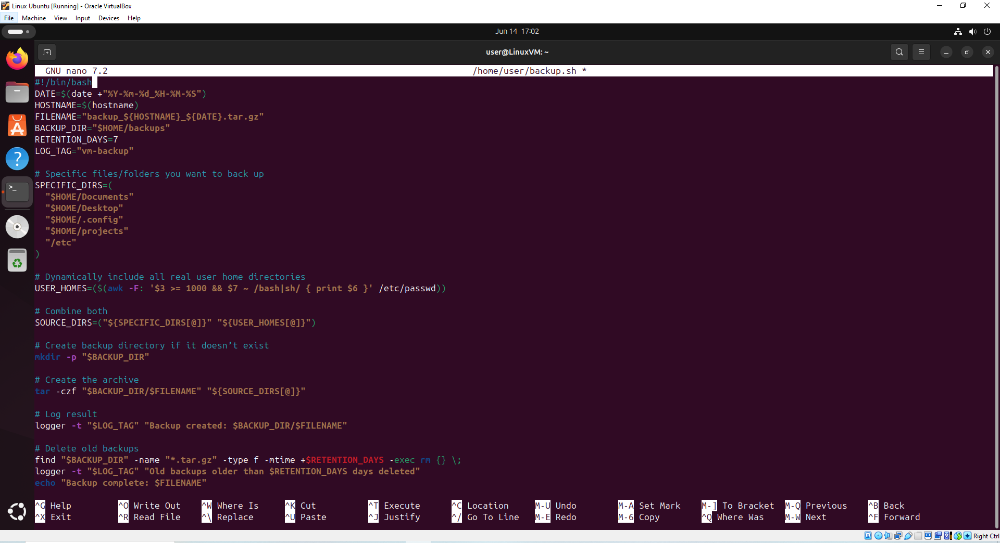

Make the script executable:

```
chmod +x backup.sh
```

Run it manually:

```
./backup.sh
```

Check that the backup archive appears in the ~/backups/ directory:

```
ls -lh ~/backups
```

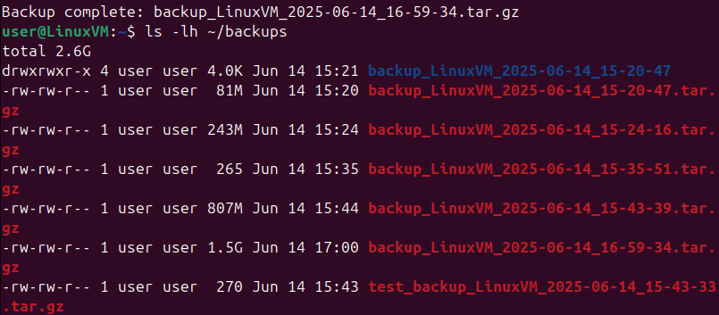

If you want to inspect the archive contents (hard to read as there are too many files/directories saved):

```
tar -tzf ~/backups/backup_LinuxVM_DATE.tar.gz
```
(After typing backup you can press tab and it will autofill the rest for you)

---

## 📁 4. Sample Test Files

To make it easier to visualize and understand the backup script, we will create a smaller version:

```
nano ~/test_backup.sh
```

This bash script will create test files: Documents/test.txt and projects/code.txt and create backups in /home/user/test_backup_source:

```
#!/bin/bash

DATE=$(date +"%Y-%m-%d_%H-%M-%S")
HOSTNAME=$(hostname)
FILENAME="test_backup_${HOSTNAME}_${DATE}.tar.gz"
BACKUP_DIR="$HOME/backups"
RETENTION_DAYS=7
LOG_TAG="vm-backup"

# Temporary test-only directories
TEST_BACKUP_SOURCE="$HOME/test_backup_source"
mkdir -p "$TEST_BACKUP_SOURCE/Documents"
mkdir -p "$TEST_BACKUP_SOURCE/projects"

echo "Test doc content" > "$TEST_BACKUP_SOURCE/Documents/test.txt"
echo "Project backup check" > "$TEST_BACKUP_SOURCE/projects/code.txt"

SPECIFIC_DIRS=(
  "$TEST_BACKUP_SOURCE"
)

SOURCE_DIRS=("${SPECIFIC_DIRS[@]}")

# Create backup directory if it doesn’t exist
mkdir -p "$BACKUP_DIR"

# Create the archive
tar -czf "$BACKUP_DIR/$FILENAME" "${SOURCE_DIRS[@]}"

# Log result
logger -t "$LOG_TAG" "Test Backup created: $BACKUP_DIR/$FILENAME"

# Delete old backups
find "$BACKUP_DIR" -name "*.tar.gz" -type f -mtime +$RETENTION_DAYS -exec rm {} \;
logger -t "$LOG_TAG" "Old backups older than $RETENTION_DAYS days deleted"

echo "Test Backup complete: $FILENAME"
```

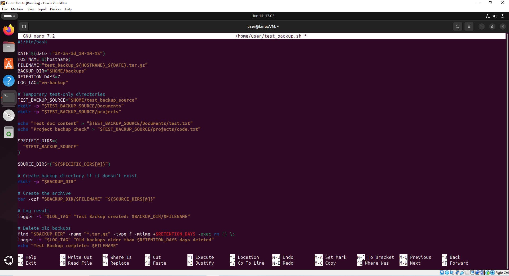

Make the script executable:

```
chmod +x test_backup.sh
```

Run it manually:

```
./test_backup.sh
```

Inspect the archive contents:

```
tar -tzf ~/backups/test_backup_LinuxVM_DATE.tar.gz
```
(After typing test_backup you can press tab and it will autofill the rest for you)

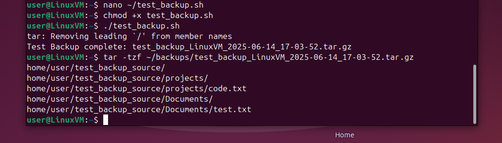

---

## ⏰ 5. Automate with Cron

Open the crontab editor:

```
crontab -e
```

Add this line to schedule the backup every day at 1:00 AM:

```
0 1 * * * /path/to/your/backup.sh
```
Path example: /home/YOURUSERNAME/backup.sh

Replace `YOURUSERNAME` with your actual Linux user.

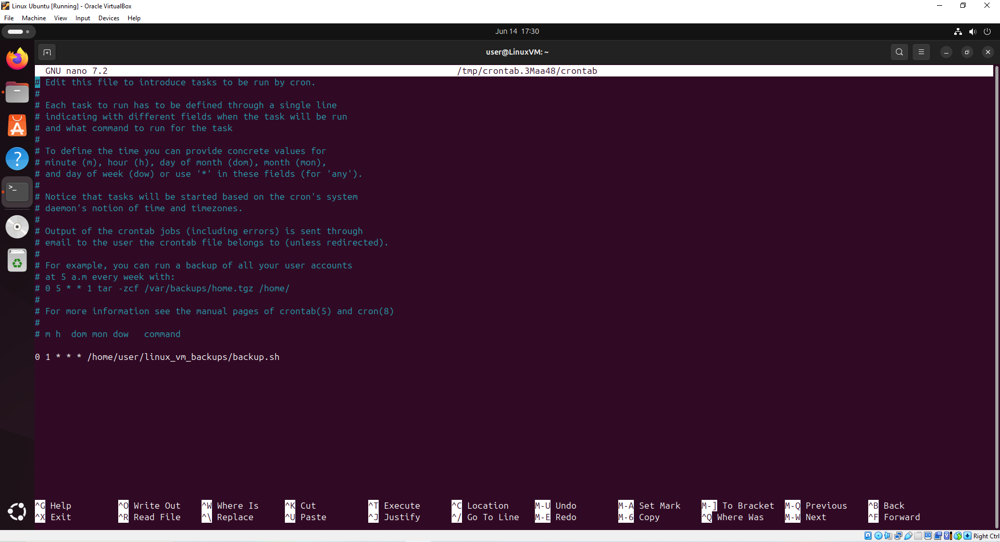

---

## 🧾 6. Log Output

Use journalctl to review log messages tagged with vm-backup:

```
journalctl | grep vm-backup
```

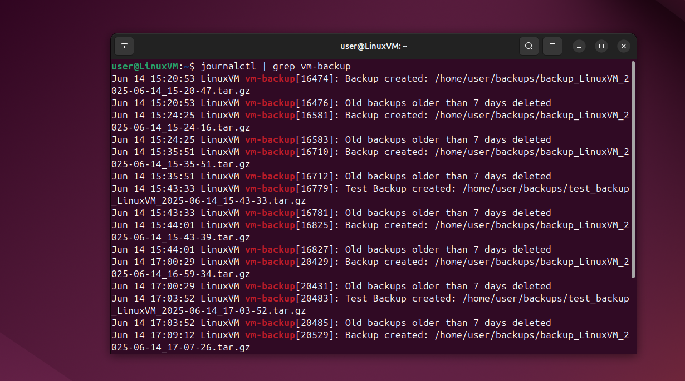

---

[](mailto:kennymiranda000@gmail.com)
[](https://linkedin.com/in/kenneth-miranda-xyz)
